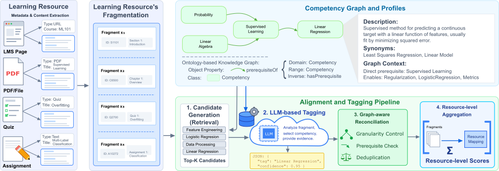

# LLM-Based Competency Tagging Pipeline

A robust, production-ready pipeline for competency tagging with evidence extraction using BM25 retrieval, LLM-based tagging, graph-based reconciliation, and comprehensive evaluation metrics.

## Features

- **BM25 Candidate Retrieval**: Efficient retrieval of top-K competency candidates using competency profiles
- **LLM-based Tagging**: OpenAI API integration with evidence extraction and validation
- **Evidence Validation & Repair**: Automatic validation and repair of evidence quotes
- **Graph Reconciliation**: Parent-child redundancy resolution and prerequisite checking
- **Resource-level Aggregation**: Fragment-to-resource aggregation with configurable methods
- **Comprehensive Evaluation**: Fragment-level, evidence, coherence, and resource-level metrics
- **Cross-validation**: 5-fold CV with hyperparameter sweeps
- **Caching & Retry Logic**: Robust API call handling with exponential backoff

## Installation

```bash
pip install -r requirements.txt
```


## Project Structure

```
.
├── src/                    # All source code
│   ├── __init__.py
│   ├── io.py
│   ├── retrieval.py
│   ├── llm_tagger.py
│   ├── reconcile.py
│   ├── aggregate.py
│   ├── metrics.py
│   ├── runner.py
│   ├── supervised_runner.py
│   ├── sbert_runner.py
│   ├── tfidf_logreg_runner.py
│   ├── tfidf_linearsvc_runner.py
│   ├── zero_shot_runner.py
│   ├── few_shot_runner.py
│   ├── cross_encoder_reranker.py
│   ├── derive_bm25_llm_no_graph.py
│   └── config.yaml         # Configuration file
├── data/                   # All data files
│   ├── competencies_utc.jsonl
│   ├── golds_fragments/
│   └── resources_fragments/
├── requirements.txt        # Python dependencies
└── README.md               # This file
```

## Data Format

### Competencies (`data/competencies_utc.jsonl`)
```json
{
  "competency_id": "C001",
  "label": "Critical Thinking",
  "description": "Ability to analyze and evaluate information...",
  "keywords": ["analysis", "evaluation", "reasoning"],
  "aliases": ["analytical thinking"],
  "neighbors": {
    "parent": ["C000"],
    "children": ["C002", "C003"],
    "prereq": ["C004"]
  }
}
```

### Fragments (`data/resources_fragments/<UV>_fragments.jsonl`)
```json
{
  "fragment_id": "F001",
  "resource_id": "R001",
  "text": "The study demonstrates critical analysis...",
  "fragment_type": "abstract",
  "token_count": 150,
  "provenance": {"page": 1}
}
```

### Gold Annotations (`data/golds_fragments/<UV>_gold_fragments.jsonl`)
```json
{
  "fragment_id": "F001",
  "gold": [
    {
      "competency_id": "C001",
      "evidence": {
        "quote": "critical analysis",
        "start": 24,
        "end": 41
      }
    }
  ],
}
```

## Configuration

Edit [src/config.yaml](src/config.yaml) to customize:

- **LLM settings**: Model, retries, evidence validation
- **Retrieval**: Number of candidates (K)
- **Reconciliation**: Max labels, parent-child preferences
- **Aggregation**: Method, threshold (τ), top-K per resource
- **Experiment**: Number of folds, parameter sweep ranges

## Usage

### Set OpenAI API Key

```bash
export OPENAI_API_KEY="your-api-key-here"
```

### Run Experiment


```bash
python -m src.runner \
  --data_dir data/resources_fragments \
  --gold_dir data/golds_fragments \
  --competencies data/competencies_utc.jsonl \
  --config src/config.yaml \
  --output_dir output
```


## Output


## Pipeline Overview



For a high-resolution version, see: [figures/framework.pdf](figures/framework.pdf)

## Pipeline Stages

### 1. Candidate Retrieval
Uses BM25 to retrieve top-K competency candidates based on fragment text similarity to competency profiles (label + description + keywords + aliases).

### 2. LLM Tagging
Calls OpenAI API with:
- Fragment text
- Candidate competencies
- Structured output format (JSON)

Returns:
- Selected competencies with confidence scores
- Evidence (quote, start_char, end_char)
- None flag if no competencies apply

### 3. Evidence Validation & Repair
- Validates that evidence quotes match fragment text at specified positions
- Attempts automatic repair if quote found elsewhere in text
- Filters invalid predictions

### 4. Graph Reconciliation
- **Parent-child redundancy**: Removes parent if child present (unless only parent has evidence)
- **Prerequisite checking**: Flags violations where competency predicted without its prerequisites
- **Label capping**: Limits to max_labels_per_fragment

### 5. Resource Aggregation
Aggregates fragment predictions to resource level:
- **Max method**: Takes maximum confidence across fragments
- **Weighted sum**: Uses fragment type weights and averages
- Applies threshold τ and selects top-K per resource


### 6. Evaluation
Computes comprehensive metrics:

**Fragment-level:**
- Micro Precision/Recall/F1
- Macro F1 (per fragment)
- Mean Reciprocal Rank (MRR): Measures the average rank position of the first correct competency prediction for each fragment, reflecting ranking quality.

**Evidence:**
- Evidence valid rate
- Evidence overlap (character IoU)

**Resource-level:**
- Macro F1 (per resource)
- Micro Precision/Recall/F1


## License

MIT License - See LICENSE file for details.

## Citation

If you use this pipeline in your research, please cite:

```bibtex
@software{competency_tagging_pipeline,
  title={From Learning Resources to Competencies: LLM-Based Tagging with Evidence and Graph Constraints},
  author={Ngoc Luyen Le},
  year={2026},
  url={https://github.com/yourusername/competency-tagging}
}
```
